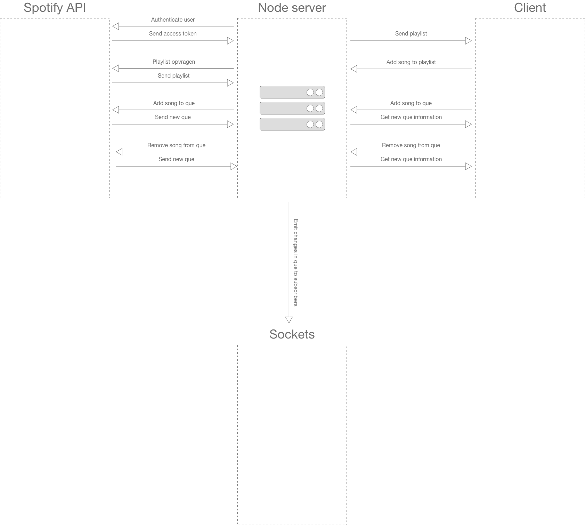

# Real-Time Web @cmda-minor-web · 2019-2020
Repository for the Real-Time-Web course..
[DEMO](https://mysterious-harbor-42719.herokuapp.com/)

## Table of contents
* [Description](#description)
* [Diagram](#diagram)
* [Prerequisites](#prerequisites)
* [Installing](#installing)

# Description
This application tries to bring people together online to listnen to their favorite music genre's and stay healthy at the same time by
giving the users workouts they need to complete. The application uses the spotify api to stream songs from a playlist.

# Diagram


## Prerequisites
* Nodejs
* NPM

## Installing

Clone repository to your local directory
```
git clone https://github.com/damian1997/real-time-web-1920.git
```

Installing dependencies
```
npm install
```

Bundle core assets and watch files
```
npm run bundle
```

Run server localy
```
npm run dev
```
