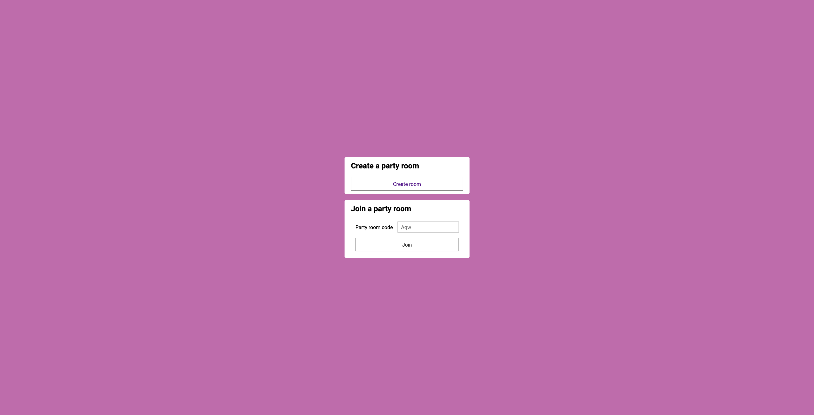
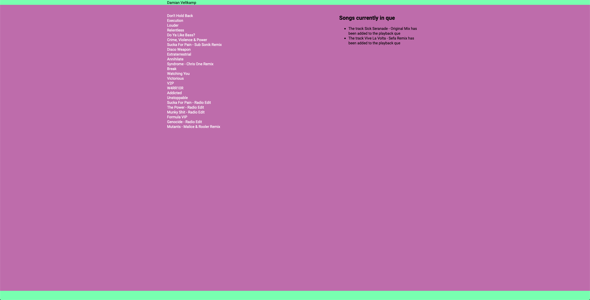
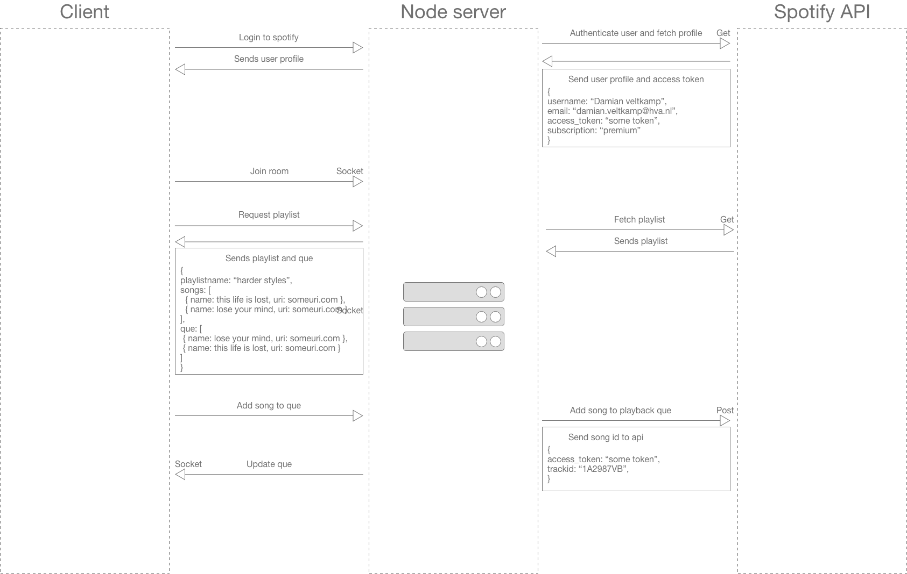

# Real-Time Web @cmda-minor-web · 2019-2020
Repository for the Real-Time-Web course.
[DEMO](https://mysterious-harbor-42719.herokuapp.com/)

## Table of contents
* [Description](#description)
* [Concept](#concept)
* [Prerequisites](#prerequisites)
* [Installing](#installing)
* [Data life cycle](#data-life-cycle)
* [Source of truth](#source-of-truth)
* [Diagram](#diagram)
* [Real time events](#real-time-events)
* [Features](#features)

# Description
This application tries to bring people together online to listen to their favorite music genre's.

# Concept
The application is build with the use of sockets, this enables us to create the possibility of communication between users in real time.
Sockets are used to create rooms which people can join and listen to the same music together. The rooms are created with a Spotify playlist
linked to the room so the users in the same room have the same music in front of them. From this playlist the users can add songs to their
playback queue and others get notified that a song is added to the queue .

<details>
<summary>Concept images</summary>
Home page after logging into Spotify.


Creating room page, list of playlists of the user.


Party room after creation with songs and q ue.

</details>

## Prerequisites
* Nodejs
* NPM

## Installing

Clone repository to your local directory
```
git clone https://github.com/damian1997/real-time-web-1920.git
```

Installing dependencies
```
npm install
```

Bundle core assets and watch files
```
npm run bundle
```

Run server localy
```
npm run dev
```

# Data life cycle
This project does not make use of a database and all the information is stored on the server.


# Source of truth
In this application the server is the only source of truth, everything is stored on the server and only from the server
decisions are being made. Because everything resides on the server the data is persistent and every user has the correct data
and is not 1 step behind the rest.

# Real time events
* Join room:

When a person enters the room others will get a updated list of users.

* Disconnect:

When a person leaves the room others will get a updated list of users.

* Add to queue:

When someone adds a song the the playback the  queue overview will be updated.

* Remove song from queue:

When the currently played song is the same as the first song in the queue the queue will be updated and posted to everyone.

# Features
- [x] Multiple rooms support.
- [x] Multiple people can join 1 room
- [x] Playlist sync with spotify account
- [x] Songs play according to queue
- [x] Pushing songs to playback queue
- [x] Playing full songs
- [x] Disconnecting from rooms updates user list
- [x] Real time updates on current song and playback queue

## What i still want to implement
- [  ] Sync playing of music
- [  ] Pausing and skipping songs
- [  ] Adjusting volume
- [  ] Room administration
